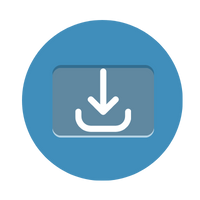

  <h1>SYTVD - Simple YouTube Video Downloader</h1>
  

## Description
SYTVD (Simple YouTube Video Downloader) is a lightweight and user-friendly web application that allows you to download YouTube videos with ease. It provides a seamless experience for downloading your favorite videos in the highest resolution available.

## Features
- Intuitive and easy-to-use user interface
- Supports downloading YouTube videos in the highest resolution
- Written in JavaScript and powered by Node.js
- Utilizes the ytdl-core library for YouTube video downloading

## Installation
1. Clone the repository: `git clone https://github.com/heyitssloth/sytvd.git`
2. Navigate to the project directory: `cd sytvd`
3. Install the required dependencies: `npm install`

## Usage
1. Start the server: `node server.js`
2. Open your web browser and go to: `http://localhost:3000`
3. Enter the YouTube video link in the provided input field
4. Click the "Download" button to start the video download

## Requirements
- Node.js
- A browser.. lol

## Contributing
Contributions are welcome! If you'd like to contribute to SYTVD, please follow these steps:
1. Fork the repository
2. Create your feature branch: `git checkout -b feature/my-feature`
3. Commit your changes: `git commit -am 'Add my feature'`
4. Push to the branch: `git push origin feature/my-feature`
5. Submit a pull request

## License
SYTVD is licensed under the [MIT License](LICENSE).

---

  Built with ❤︎ by Lyra (https://github.com/heyitssloth)
  
  Join our Discord community to stay updated and interact with other users.

